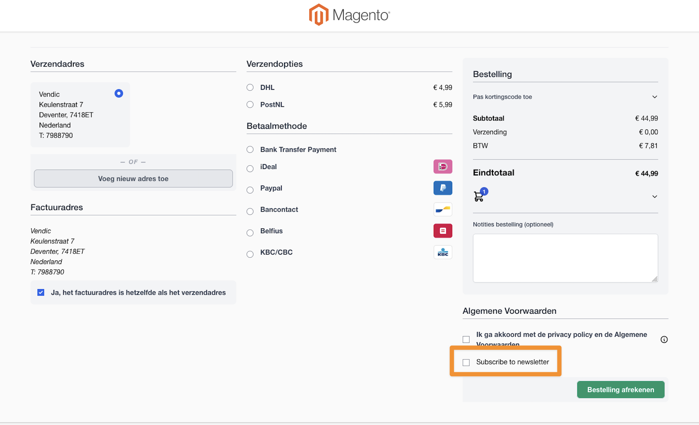

# Vendic_HyvaCheckoutNewsletterSubscribe
Adds a newsletter subscribe checkbox on the [Hyvä checkout](https://www.hyva.io/hyva-checkout.html) for [Mage-OS](https://mage-os.org/) / Magento 2.

## Installation
```bash
composer require vendic/hyva-checkout-newsletter-subscribe
```

## Configuration
None at this moment. When enabled, this module will add a newsletter subscription checkbox to the Hyvä checkout.

## Screenshot


