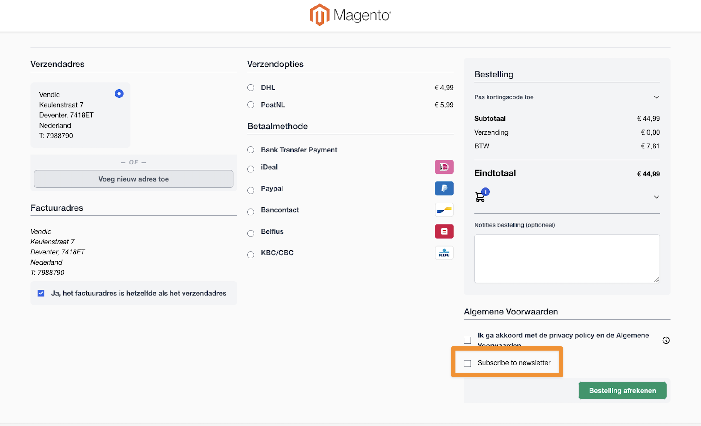

# Vendic_HyvaCheckoutNewsletterSubscribe
Adds a newsletter subscribe checkbox on the [Hyvä checkout](https://www.hyva.io/hyva-checkout.html) for [Mage-OS](https://mage-os.org/) / Magento 2.

## Installation
```bash
composer require vendic/hyva-checkout-newsletter-subscribe
```

## Configuration
You can set initial state of checkbox in `Stores > Configuration > Vendic > Hyva Checkout Newsletter Subscribe`:
- `Is subscribe newsletter checkbox enabled by default (initially)` - set to `Yes` if you want the checkbox to be checked by default.

## Screenshot


